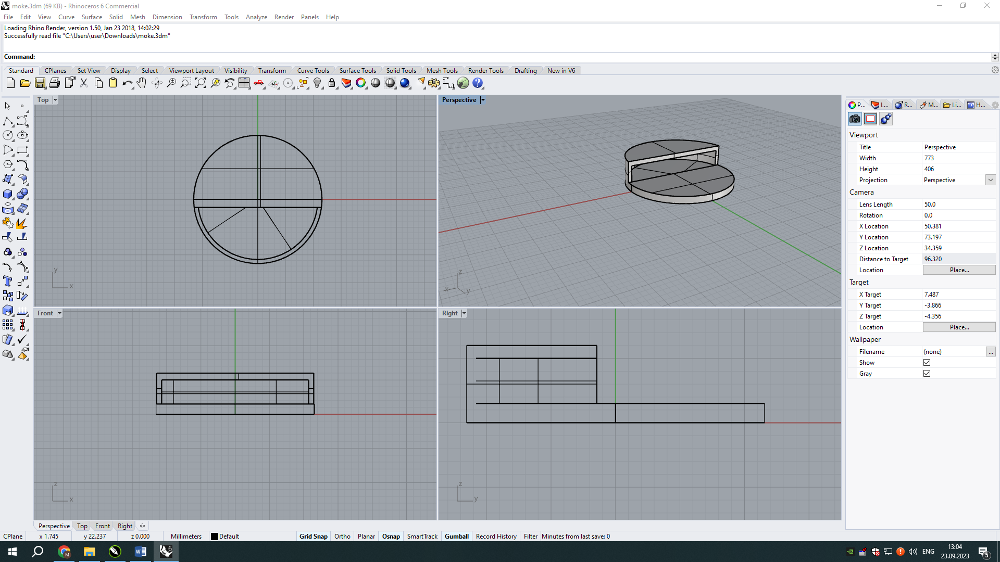
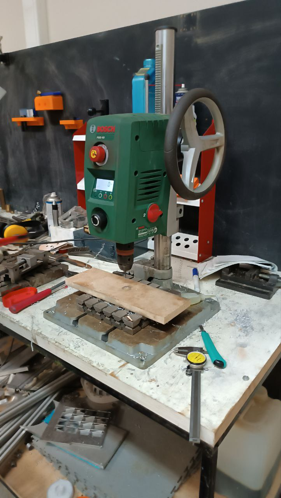

# Practic-23.09
**Описание работы** - Создание подделки из фанеры для освоения нескольких компетенций

**Оборудование** -
Паяльное оборудование, лазерный станок, медный провод, светодиоды, компьютерные программы( CorelDraw, Rhino6, Prusa).

**Цель** -
Создание формы из фанеры с работающими светодиодами

**Этапы работы**
1) Создание модели в программе CorelDraw и последующее вырезание из фанеры на лазерном станке
   

3) Конструирование модели держателя батареи в Rhino6
   

4) Создание файла слайсера для держателя в программе Prusa и печать держателя на 3Д принтере Prusa

https://github.com/Alberyn/Practic-23.09/assets/78211591/7ce3c848-7d04-4049-909f-223a9404cede

5) Просверливание отверстий для проводов в модели из фанеры с помощью сверлильного станка

6) Прикрепление держателя для батареи на клей в модели и продевание медных проводов в модели и их припойка к светодиодам
   
На картинке представлен рабочий стол с используемыми инструментами

7) Готовое изделие

**Обзор работы** 

Для выполнения данного задания, мы использовали все методы и знания, которые мы узнали за предыдущие занятия: создание модели с последующей вырезкой из фанеры, создание модели с последующим созданием на 3Д принтере, а также получили  опыт в паянии проводов.

**Недостатки работы**

1) Ошибка с расположением лазера на листе фанеры - получившиеся форма отличается от спроектируемой
2) Не оптимальное расположение светодиодов - затруднена пайка медного провода и контактов диодов
